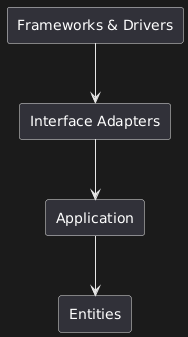
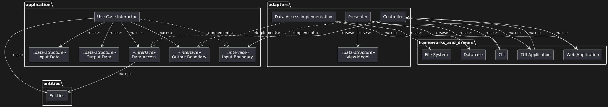
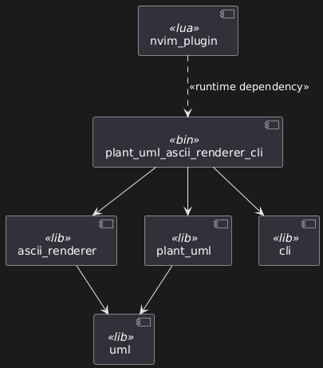
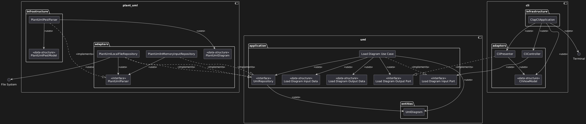

# uml-rs

## What is it

uml-rs is simply a Rust learning opportunity. I've been trying to learn Rust for a while now but never actually stick with a project until the end.
This is my attempt to remedy that.

The idea is to handle uml diagrams with code. Initially I aim to support PlantUML with ASCII rendering.
The project will be considered stable once it is able to render all of the projects's PlantUML diagrams.

## Goals

The current main goal is enough development to support the project's own diagrams.

### PlantUML Support

Currently, the focus is on a subset of component diagrams. Support for more diagram types and syntax is planned for the future.

### ASCII Rendering

As I've never dwelt into graphics programming, I believe an ASCII representation of the diagram is a good start

### CLI

The main way to interact with the project will be through a CLI for now

### Neovim Integration

Once the tool is mature enough I aim to add Neovim integration for rendering diagrams directly inside Neovim without needing a heavyweight plugin.

Once done, a simple :PlantUMLAscii command in any buffer containing PlantUML code should render a live ASCII preview.

## Architecture

As well as a Rust learning opportunity this project is also a place for me to exercise my Software Architecture Design skills

The project follows a Clean Architecture design packaged by components.
I devide the code into 4 main layers:



```
@startuml
rectangle "Frameworks & Drivers" as frameworks_and_drivers
rectangle "Interface Adapters" as interface_adapters
rectangle Application as application
rectangle Entities as entities

application --> entities
interface_adapters --> application
frameworks_and_drivers --> interface_adapters
@enduml
```

As an example usage we could have:



```
@startuml
package entities {
    rectangle Entities as entities_classes
}

package application {
    rectangle "Use Case Interactor" as use_case_interactor
    rectangle "Input Data" as input_data <<data-structure>>
    rectangle "Output Data" as output_data <<data-structure>>
    rectangle "Input Boundary" as input_boundary <<interface>>
    rectangle "Output Boundary" as output_boundary <<interface>>
    rectangle "Data Access" as data_access <<interface>>

    use_case_interactor ..|> input_boundary : <<implements>>
    use_case_interactor --> output_boundary : <<uses>>
    use_case_interactor --> input_data : <<uses>>
    use_case_interactor --> output_data : <<uses>>
    use_case_interactor --> data_access : <<uses>>
    use_case_interactor --> entities_classes : <<uses>>

    data_access --> entities_classes : <<uses>>
}

package adapters {
    rectangle "Data Access Implementation" as data_access_impl
    rectangle Presenter as presenter
    rectangle Controller as controller
    rectangle "View Model" as view_model <<data-structure>>

    data_access_impl ..|> data_access : <<implements>>
    controller --> input_boundary : <<uses>>
    presenter ..|> output_boundary : <<implements>>
    presenter --> view_model : <<uses>>
}

package frameworks_and_drivers {
    rectangle CLI as cli
    rectangle "TUI Application" as tui_application
    rectangle "Web Application" as web_application
    rectangle "File System" as file_system
    rectangle Database as database_

    presenter --> cli : <<uses>>
    presenter --> tui_application : <<uses>>
    presenter --> web_application : <<uses>>

    cli --> controller : <<uses>>
    tui_application --> controller : <<uses>>
    web_application --> controller : <<uses>>

    data_access_impl --> file_system : <<uses>>
    data_access_impl --> database_ : <<uses>>
}
@enduml
```

Layer names and configuration may vary.

Currently I aim to have the following components:



```
@startuml
component uml <<lib>>
component ascii_renderer <<lib>>
component plant_uml <<lib>>
component cli <<lib>>
component nvim_plugin <<lua>>
component plant_uml_ascii_renderer_cli <<bin>>

ascii_renderer --> uml
plant_uml --> uml

plant_uml_ascii_renderer_cli --> plant_uml
plant_uml_ascii_renderer_cli --> ascii_renderer
plant_uml_ascii_renderer_cli --> cli

nvim_plugin ..> plant_uml_ascii_renderer_cli : <<runtime dependency>>
@enduml
```

By using Cargo Workspaces we can separate each component into its own 'module'.
Most of the components are libraries with the executable binary crates being the ones that actually instantiate all objects.

The full intented architecture is as follows:



```
@startuml
circle "File System" as file_system
circle Terminal as terminal

component uml {
    package entities as uml_entities {
        rectangle UmlDiagram as uml_diagram
    }

    package application as uml_application{
        rectangle "Load Diagram Use Case" as load_diagram_use_case
        rectangle "Load Diagram Input Data" as load_diagram_input_data <<data-structure>>
        rectangle "Load Diagram Output Data" as load_diagram_output_data <<data-structure>>
        rectangle "Load Diagram Input Port" as load_diagram_input_port <<interface>>
        rectangle "Load Diagram Output Port" as load_diagram_output_port <<interface>>
        rectangle "UmlRepository" as uml_repository <<interface>>

        load_diagram_use_case ..|> load_diagram_input_port : <<implements>>
        load_diagram_use_case --> load_diagram_output_port : <<uses>>
        load_diagram_use_case --> load_diagram_input_data : <<uses>>
        load_diagram_use_case --> load_diagram_output_data : <<uses>>
        load_diagram_use_case --> uml_repository : <<uses>>
        load_diagram_use_case --> uml_diagram : <<uses>>

        uml_repository --> uml_diagram : <<uses>>
    }
}

component plant_uml {
    package adapters as plant_uml_adapters {
        rectangle PlantUmlLocalFileRepository as plant_uml_local_file_repository
        rectangle PlantUmlInMemoryInputRepository as plant_uml_in_memory_input_repository
        rectangle PlantUmlParser as plant_uml_parser <<interface>>
        rectangle PlantUmlDiagram as plant_uml_diagram <<data-structure>>

        plant_uml_local_file_repository ..|> uml_repository : <<implements>>
        plant_uml_local_file_repository --> uml_diagram : <<uses>>
        plant_uml_in_memory_input_repository ..|> uml_repository : <<implements>>
        plant_uml_in_memory_input_repository --> uml_diagram : <<uses>>

        plant_uml_local_file_repository --> plant_uml_parser : <<uses>>
        plant_uml_local_file_repository --> file_system : <<uses>>
        plant_uml_in_memory_input_repository --> plant_uml_parser : <<uses>>
    }

    package infrastructure as plant_uml_infrastructure {
        rectangle PlantUmlPestParser as plant_uml_pest_parser
        rectangle PlantUmlPestModel as plant_uml_pest_model <<data-structure>>

        plant_uml_pest_parser ..|> plant_uml_parser : <<implements>>
        plant_uml_pest_parser --> plant_uml_diagram : <<uses>>
        plant_uml_pest_parser --> plant_uml_pest_model : <<uses>>
    }
}

component cli {
    package adapters as cli_adapters {
        rectangle CliPresenter as cli_presenter
        rectangle CliController as cli_controller
        rectangle CliViewModel as cli_view_model <<data-structure>>

        plant_uml_local_file_repository ..|> uml_repository : <<implements>>
        cli_controller --> load_diagram_input_port : <<uses>>
        cli_presenter ..|> load_diagram_output_port : <<implements>>
        cli_presenter --> cli_view_model : <<uses>>
    }

    package infrastructure as cli_infrastracture {
        rectangle ClapCliApplication as clap_cli_application

        clap_cli_application --> cli_presenter : <<uses>>
        clap_cli_application --> cli_controller : <<uses>>
        clap_cli_application --> cli_view_model : <<uses>>
        clap_cli_application --> terminal : <<uses>>
    }
}
@enduml
```

(Some helper classes are hidden for simplicity)
