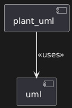

# plant_uml

## Architecture

This component handles all logic related to PlantUML.
Following Clean Architecture, this component is a 'plugin' to the main higher level uml component

That means it can theoratically be swapped for another component (ie. a Mermaid component)

It is composed of two layers: the Adapters layer and the Infrastructure layer:
In the Adapters layer the main sub-components are the Repository implementations and in the Infrastructure layer it is the Parser

### Repository

The Repositories sub-components are the implementations of the uml component's Repository interfaces.
It is this boundary that allows the plant_uml be treated as a 'plugin' to the uml component

### Parser

The parser implementation sits behind a Parser interface depended upon by the Repository.
That way we can swap out Parser implementations without touching the adapters layer.
